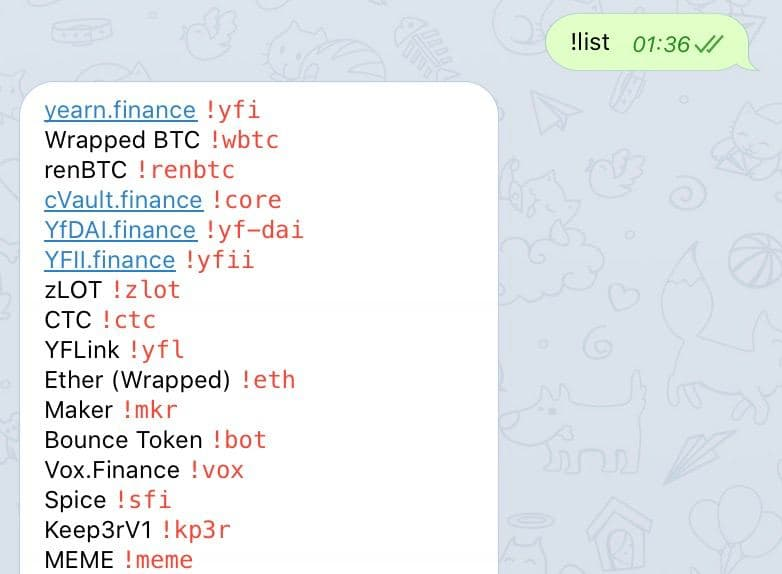
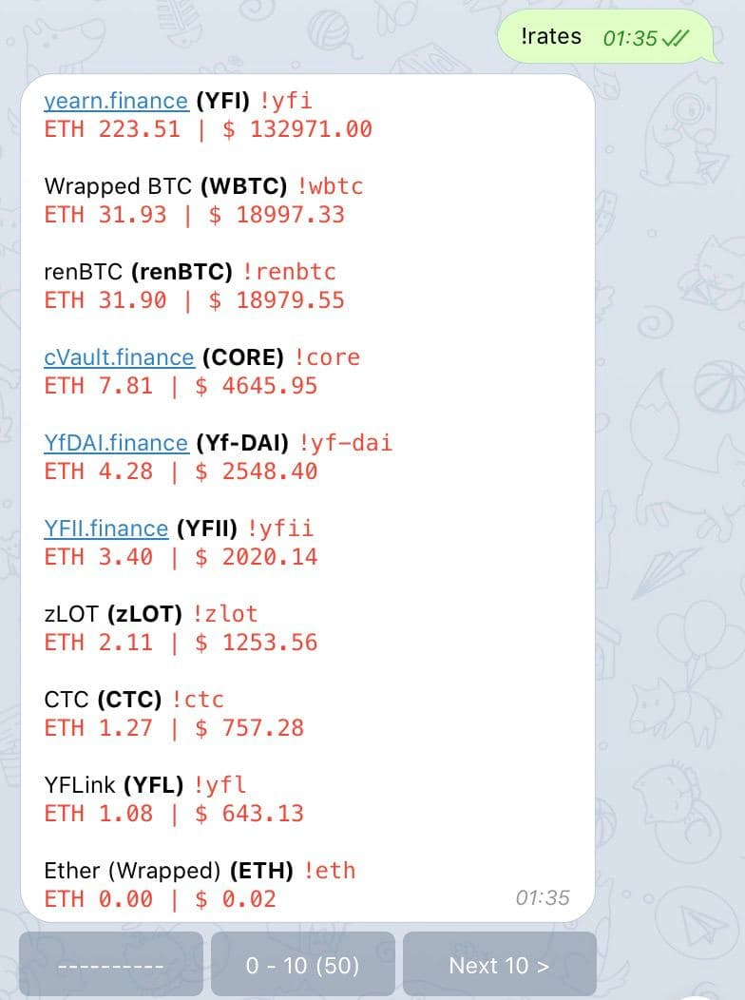
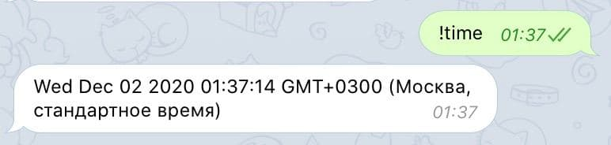
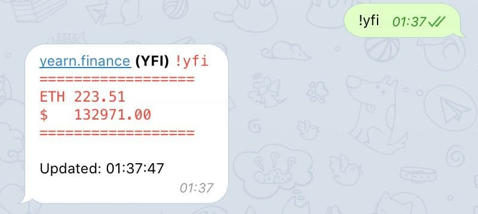

# [UniInfoBot](https://t.me/UniInfoBot)

## Overview

The Telegram bot for currency rates monitoring. It shows the top 50 currencies from the Uniswap.

## Usage

There is a list of static commands:

- **`!list`** - shows the list of supported coins as commands.

  

- **`!rates`** - shows the paginated list of supported coins with rates inline.

  

- **`!time`** - just a checker the real-time features are available.

  

Also, there are dynamically generated commands which are equal to coins tickers. For example **`!wbtc`** or **`!yfi`**.

